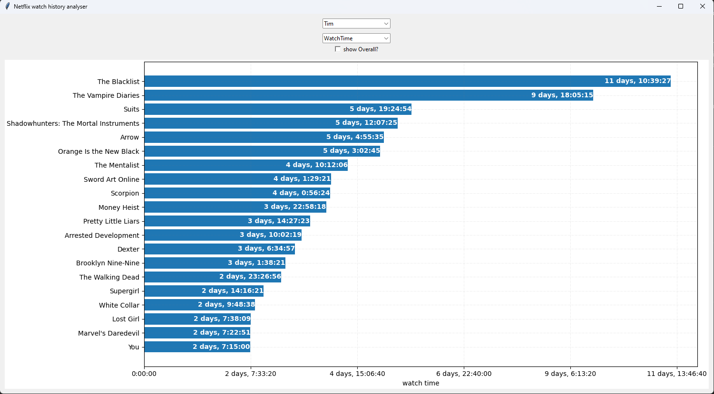
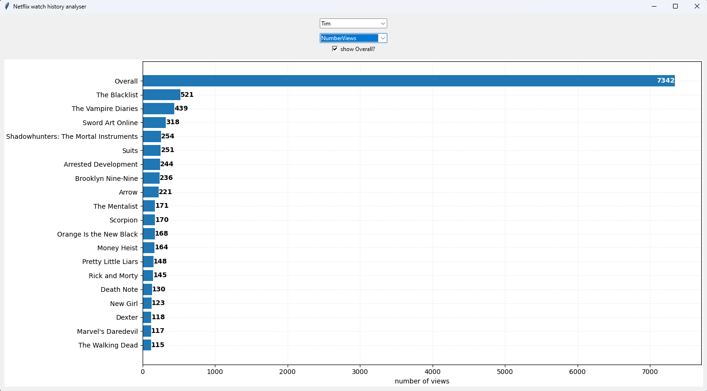

# Netflix Analyse Watchhistory

This is a basic python GUI using tkinter and matplotlib to visualize your netflix watch history.

You can request your Netflix data [in your Account Settings](https://www.netflix.com/account/getmyinfo).

This program analyses the file CONTENT_INTERACTION/ViewingActivity.csv and groups the data by profile and show title.
The grouping works based on common words/phases in episode titles (eg. "Season 1:" or "Part 3:").
This should covers most shows and can be extended by regex in CSVEntry.py.

My sample data was only in english and german so your mileage may vary. 

Also unfortunately Netflix sometimes translates show titles. This can result in incorrect grouping if you watch parts of a show in one language and then switch to another.

# Usage 
If the files are places inside your netflix-report folder it should find the data automatically.
If it can't find the data, you will be prompted to select the file "netflix-report/CONTENT_INTERACTION/ViewingActivity.csv" manually.

Run with  ```python3 ./netflixAnalysis.py```.

On Windows I had to use ```python3 -X utf8 ./netflixAnalysis.py``` instead.

# Screenshots
Shows your added up watch time for each show


Shows the amount of played episodes for each show
